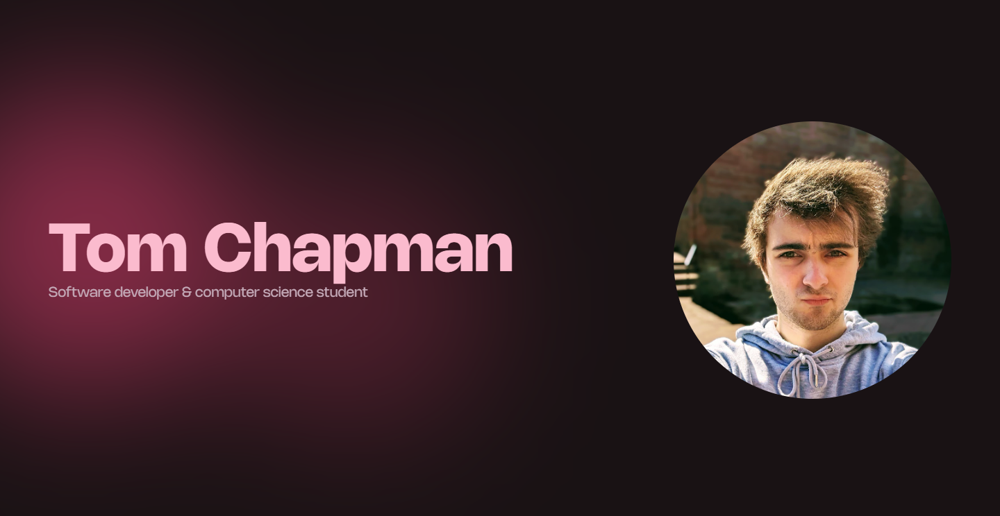

<h1 align="center">
  tomchapman.dev - v3
  
  <blockquote style="margin-top: 10px;">
    <a href="https://www.tomchapman.dev" target="_blank" style="font-size: 85%; text-align: center; display: inline-block; width: 100%;">See it in action</a>
  </blockquote>
</h1>

This is the third iteration of my personal website. It's built using pure HTML, SCSS and JS, and currently hosted using GitHub Pages.

Previous iterations of my website can be found here:
<a href="https://github.com/tomc128/personal-website-v2" target="_blank">v2</a> | <a href="https://github.com/tomc128/personal-website-v1" target="_blank">v1</a>

# 🪪 License

Yes, my website is open source! You can find the license [here](LICENSE.md).

In a nutshell, you can use my site's code however you like, but you must credit me and link back to this repo.

# 🚀 Getting Started

It's just a static site. No bells and whistles, no JavaScript backend. Just slap it on a web server and you're good to go.